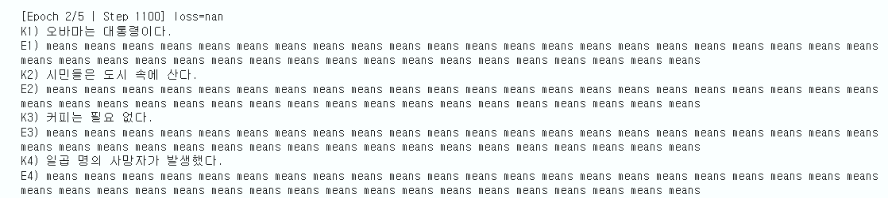
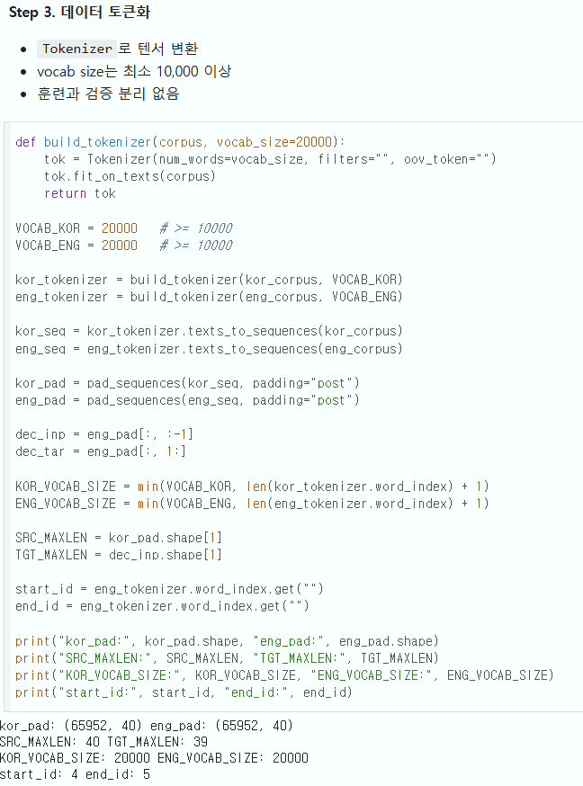
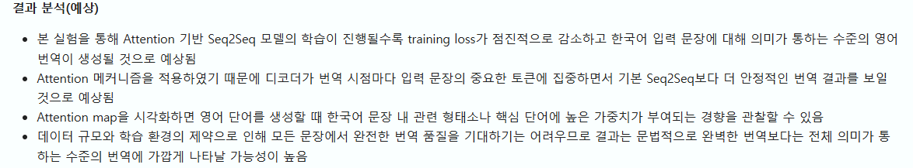
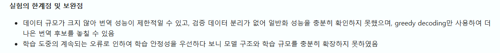
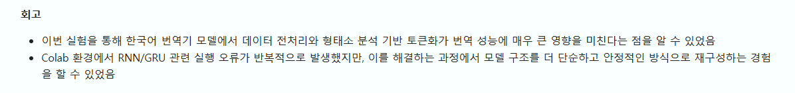
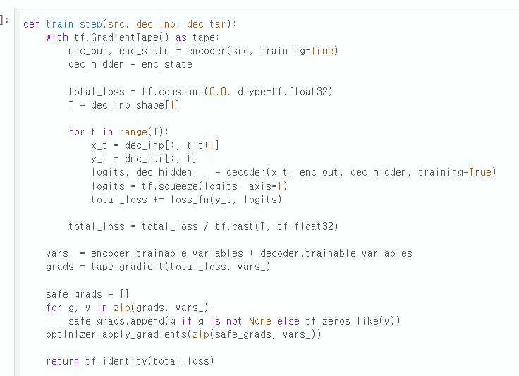

# AIFFEL Campus Online Code Peer Review Templete
- 코더 : 신대웅
- 리뷰어 : 채세현

# PRT(Peer Review Template)
- [x]  **1. 주어진 문제를 해결하는 완성된 코드가 제출되었나요?**
    - 문제에서 요구하는 최종 결과물이 첨부되었는지 확인
        - 한국어 문장을 영어로 번역하는 테스크를 진행해 얼마나 잘 번역하는 지 정성적평가를 진행하였다.
        - 
    
- [x]  **2. 전체 코드에서 가장 핵심적이거나 가장 복잡하고 이해하기 어려운 부분에 작성된 
주석 또는 doc string을 보고 해당 코드가 잘 이해되었나요?**
    - 해당 코드 블럭을 왜 핵심적이라고 생각하는지 확인
    - 해당 코드 블럭에 doc string/annotation이 달려 있는지 확인
    - 해당 코드의 기능, 존재 이유, 작동 원리 등을 기술했는지 확인
    - 주석을 보고 코드 이해가 잘 되었는지 확인
        - 각 언어 전처리 과정을 정리하였다.
        - 
        
- [x]  **3. 에러가 난 부분을 디버깅하여 문제를 해결한 기록을 남겼거나
새로운 시도 또는 추가 실험을 수행해봤나요?**
    - 문제 원인 및 해결 과정을 잘 기록하였는지 확인
    - 프로젝트 평가 기준에 더해 추가적으로 수행한 나만의 시도, 
    실험이 기록되어 있는지 확인
        - 모델의 출력을 바탕으로 결과를 예측하고 분석하여 다음 실험을 진행하였다.
        - 
        - 
        
- [x]  **4. 회고를 잘 작성했나요?**
    - 주어진 문제를 해결하는 완성된 코드 내지 프로젝트 결과물에 대해
    배운점과 아쉬운점, 느낀점 등이 기록되어 있는지 확인
    - 전체 코드 실행 플로우를 그래프로 그려서 이해를 돕고 있는지 확인
        - 회고를 적절히 작성하였다.
        - 
        
- [x]  **5. 코드가 간결하고 효율적인가요?**
    - 파이썬 스타일 가이드 (PEP8) 를 준수하였는지 확인
    - 코드 중복을 최소화하고 범용적으로 사용할 수 있도록 함수화/모듈화했는지 확인
        - 코드를 함수단위로 모듈화하여 재사용성을 높임
        - 

# 회고(참고 링크 및 코드 개선)
프로젝트내에 step 별로 분리하고 간단한 설명이 되어 있는 점이 좋았고 시작 부분에 간단한 목표와 조건이 명시되어 있어 보기 좋았습니다. 그 외에도 프로젝트 과정을 자세히 설명해주시고 참고 많이 됐습니다.
